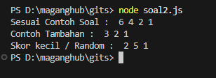
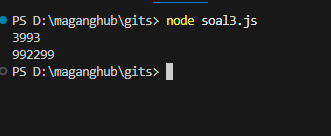

# بِسْمِ اللّٰهِ الرَّحْمٰنِ الرَّحِيْمِ
Keterima magang amin ya Allahhh 🙏🙏🙏

# Muhammad Nahrul Hayat
email : muhammadnahrulhayat98@gmail.com
portofolio : https://nahrul.vercel.app/

# 📋 Internship - Problem Solving Test 
Sebelum mengerjakan HARAP MEMBACA ATURAN di bawah ini!

# 🚀 ATURAN SUBMIT:
Terdapat 3 soal Problem Solving dengan score masing-masing di section berikutnya.
Buat pemanggilan fungsi tiap soal dengan 3 Input berbeda.
Submit jawaban cukup memasukkan link github/gitlab di field Link GitHub/GitLab pada halaman terakhir form.
Link GitHub / GitLab yang disubmit  mencakup 1 repo berisi 3 file kode(3 jawaban) dan screenshot output.
Beri akses link GitHub / GitLab yang disubmit secara publik atau ke irfan.handoko@gits.id.
Batas waktu submit: 24 jam setelah menerima link test.

🤖 ATURAN ROLE & LANGUAGE:
BE/FE/Web Fullstack: JS/PHP/Go/Java/C#
Mobile: Kotlin/Swift/Java/Dart

Jika ditemukan KETIDAKSESUAIAN dengan ATURAN di atas, maka akan mendapat pengurangan poin.

Pertama, sebelum mengerjakan soal tes alangkah baiknya berdoa terlebih dahulu. 🙏
Selamat mengerjakan dan semoga lancar! 👍

# Jawaban : 

# Soal 1 

# Soal 2

# Soal 3 
